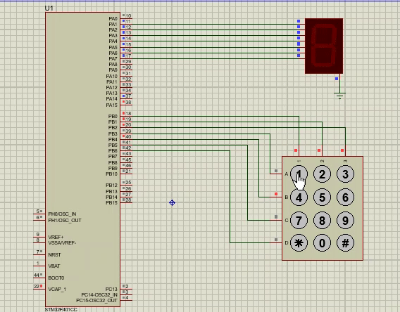

# Keypad

This project is a simple dialing phone. It display a number on a seven-segment display after pressing a button on a keypad.

## Components
* Stm32f401cc Microcontroller
* keypad
* 7 segment

## Demo

_Simulated using Proteus 8 Professional v8.10_
